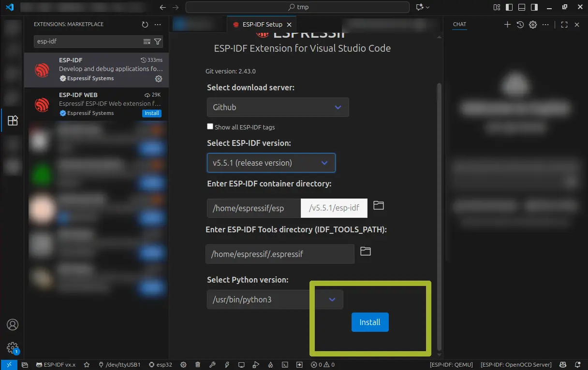
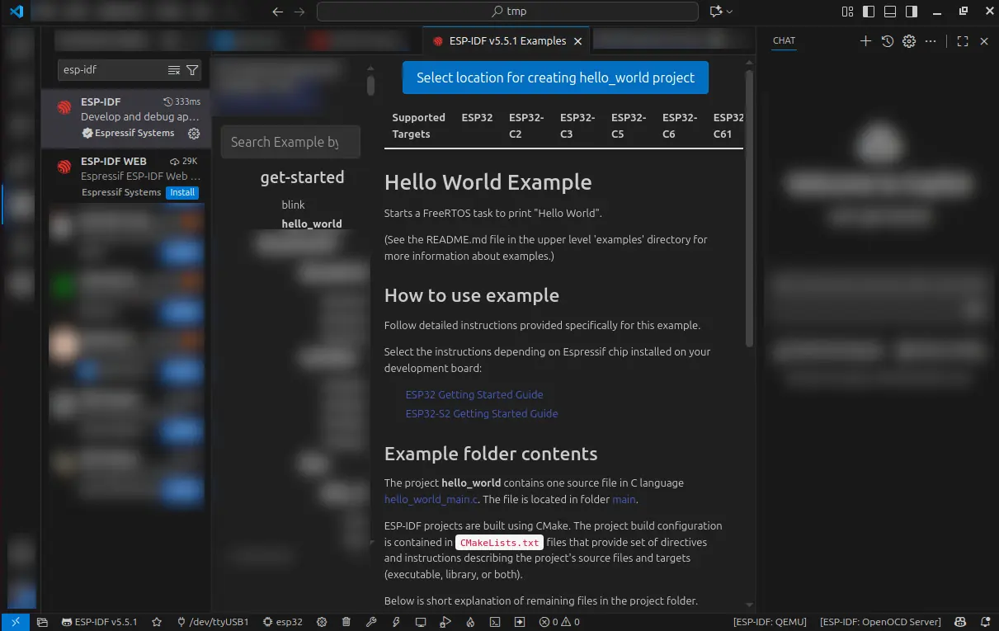

## Introduction

In this guide, we’ll go through how to set up the development environment to work on projects based on the ESP-IDF toolchain.

We’ll use the open-source IDE [VS Code](https://code.visualstudio.com/) and the *ESP-IDF extension for VS Code*, which allows you to configure the toolchain, build projects, and program the flash memory of Espressif modules.

If you don’t have an Espressif EVK available, you can still complete all the steps in this guide except the last one.

For the final step, you’ll need an EVK based on any Espressif SoC. During the workshop, you’ll receive a board based on the `ESP32-C3`, the [`ESP32-C3-DevKit-RUST-1`](https://github.com/esp-rs/esp-rust-board?tab=readme-ov-file#rust-esp-board).


The term **ESP-IDF** is used both to refer to the [toolchain itself](https://github.com/espressif/esp-idf?tab=readme-ov-file#espressif-iot-development-framework) and to the [VS Code extension](https://github.com/espressif/vscode-esp-idf-extension?tab=readme-ov-file#esp-idf-extension-for-vs-code).
In this guide, we’ll explicitly use *ESP-IDF toolchain* for the first and *ESP-IDF extension* for the second.


The guide is divided into 5 parts:

1. Installing VS Code and prerequisites
2. Installing the ESP-IDF extension for VS Code
3. Configuring the ESP-IDF toolchain
4. Building the first project
5. Flashing the module

## Installing VS Code and Prerequisites

This step depends on your operating system. Follow the appropriate guide below:

* 🐧 Linux: [Installing VS Code and prerequisites](./installation_linux/)
* 🪟 Windows: [Installing VS Code](./installation_windows/)
* 🍎 macOS: [Installing VS Code and prerequisites](./installation_macos/)


## Installing the ESP-IDF Extension for VS Code

Once all prerequisites are installed, we can add the ESP-IDF extension to VS Code.
Through the **ESP-IDF extension**, we’ll then install and configure the **ESP-IDF toolchain**.

* Open VS Code
* Click the Extensions icon (four squares) on the left
  
* In the search bar, type `esp-idf`
  
* Click “Install” on the first result, **ESP-IDF**

  * If prompted, click “Accept and Install”

## Configuring the ESP-IDF Toolchain

Once the ESP-IDF extension is installed, run the configuration process to automatically install the entire ESP-IDF toolchain.

* Click on `Configuring the ESP-IDF Extension`
  


If the configuration page didn’t open automatically, you can:

* Open the command palette (`F1` or `CTRL+SHIFT+P`)

* Type:<br>
  `> ESP-IDF: Configure ESP-IDF Extension`
  

* A new tab opens → Click on `EXPRESS`
  

* Open the dropdown menu `Select ESP-IDF version`
  

* Select `5.5.1 (release version)`
  

* Click `Install`
  

* Wait for the installation to complete
  
  
  The installation can take quite some time.
  

* When it’s done, you’ll see the confirmation screen
  


## Building the First Project

Now that the extension and toolchain are installed, it’s time to test building a project.
We’ll create a new project based on one of the examples included with the ESP-IDF toolchain.

### Create a Project from an Example

* Open the command palette (`F1` or `CTRL+SHIFT+P`)
* Type `ESP-IDF: Show Example Project` and select it
  
* In the dropdown menu, select `ESP-IDF v5.5.1`
  
* A tab with a list of example projects appears → select `hello_world`
  
* The project description appears in the central tab
* Click `Select location for creating hello_world project`
  
* Choose a folder to create the project and click `Select this folder`
* A new VS Code window opens
* You should now see the files for the `hello_world` example project in the right panel
  


If you don’t see the files, make sure the first icon on the left (two overlapping sheets) is selected.



### Specify the Target

To build and flash the project to your Espressif module, you must tell the compiler which SoC you’re targeting.
In the workshop, we’ll use a board based on the ESP32-C3, so we’ll select that target.


If you have a different EVK available, select the corresponding target.


* Open the command palette (`F1` or `CTRL+SHIFT+P`) and type
  `ESP-IDF: Set Espressif Device Target`
  
* From the dropdown → select `esp32c3`
  
* In the following dropdown → select `ESP32-C3 chip (via builtin USB-JTAG)`
  


### Build the Project

Now let’s build the project.

* Open the command palette (`F1` or `CTRL+SHIFT+P`)
* Type `ESP-IDF: Build Your Project`
  
* A terminal will open at the bottom showing build messages
* When the build finishes, you’ll see the memory usage summary
  

If you see the summary screen, both the toolchain and extension were installed correctly.

If you have an Espressif EVK, proceed to the next section to verify USB connectivity.


## Flashing the Module

Once the project is built, it’s time to flash the module.
The ESP-IDF extension for VS Code provides the command:
`> ESP-IDF: Flash (UART) Your Project`

However, the most commonly used command is:

```console
> ESP-IDF: Build, Flash and Start a Monitor on Your Device
```

This command not only builds and flashes the project to the device but also starts a serial monitor directly in the editor terminal.

To flash the module:

1. Select the port your EVK is connected to
2. Run the command:
   `> ESP-IDF: Build, Flash and Start a Monitor on Your Device`


On Linux, you may need to add your user to the `dialout` group to access serial ports without admin privileges:

```
sudo usermod -a -G dialout $USER
```

Remember to log out and back in for the changes to take effect.



### Select the Port the EVK is Connected To

* Connect the board to your computer via USB
* If VS Code is closed, reopen it and open your project folder

  * `File → Open Folder` or `File → Open Recent`
* Open the command palette and type:
  `> ESP-IDF: Select Port to Use (COM, tty, usbserial)`
  
* Select the port (Silicon Labs – the USB/UART bridge on the EVK)
  
* The port name will now appear in the bottom status bar
  


If your operating system doesn’t automatically detect the connected board, refer to the appropriate guide:

* 🪟 [Windows](https://docs.espressif.com/projects/esp-idf/en/stable/esp32/get-started/establish-serial-connection.html#check-port-on-windows)
* 🐧 [Linux](https://docs.espressif.com/projects/esp-idf/en/stable/esp32/get-started/establish-serial-connection.html#check-port-on-linux-and-macos)
* 🍎 [macOS](https://docs.espressif.com/projects/esp-idf/en/stable/esp32/get-started/establish-serial-connection.html#check-port-on-linux-and-macos)
  


### Flash the Module and Start the Monitor

* Open the command palette and type:
  `> ESP-IDF: Build, Flash and Start a Monitor on Your Device`
  
* From the dropdown → select `UART`
  
* Wait for the flashing process to complete and for the monitor to start
* In the terminal, you’ll see the boot messages and the “hello world!” output
  

If you see the message in the terminal, your setup is working correctly and you’re ready for the workshop and for developing projects based on ESP-IDF.


## Conclusion

In this guide, we covered how to install VS Code, the ESP-IDF extension, and the ESP-IDF toolchain.
We also went through how to create, build, and flash a project to your EVK.
Your development environment is now ready to use.

